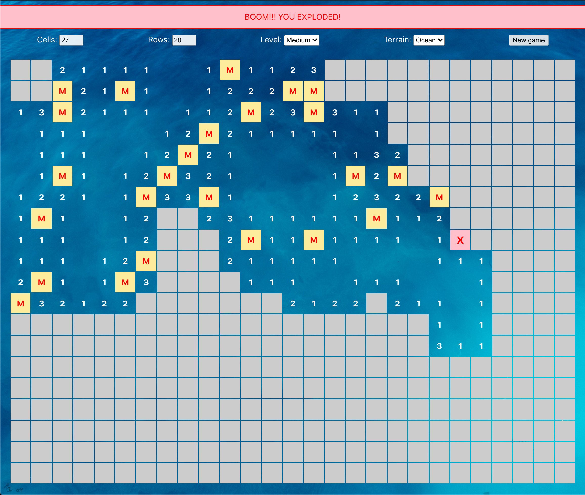

# Minesweeper

This game was originally used to teach people to teach people how to use the computer mouse (which was a recent invention).

Now, it's still challenging in the original way - when using the laptop trackpad. See the screenshot below. I meant to "two-finger tap" ("right click"), but I accidentally did a "one-finger tap" ("left click"). Oops! Exploded!

## This version

- Fills the entire screen! Would be good as a phone/tablet app.

- Makes the first move for you - to remove the anxiety of guessing where to click first - so you don't blow up on the first move.

- Allows you to play after you make a wrong move. You just have to live with the ugly error message and the ugly "X" tainting your otherwise perfect board.

## TODO:

- **Controls at the top are not yet functional!** For now, refresh the page to start a new game.

- **It still needs more styling. Currently unfinished.**

- Icons for bomb/flag. Currently "X" for bomb, "M" for marked.

## Future improvemnts:

**Lets make a more positive and inviting version of minesweeper!** \
Getting a move wrong is very unsettling, unnerving, not fun! Would be nice to re-imagine the classic minesweeper game to one where you do not just lose after the very first mistake. Instead, wouldn't it be nice to keep playing? So, What I imagine is the app counts how many "bombs" are in the game. Instead of thinking of them as "bombs", they can be "gifts" or "treats" or "Pokemon"!

You "mark" a hidden spot, where you think the Pokemon is. If you're right, you catch that Pokemon, and are rewarded with a nice fun graphic or animation. If you're wrong, the creature runs away, the cell becomes empty, and neighboring cells are uncovered as if you clicked on a cell which never had any bomb in the first place. However, the game should keep a tally of how many Pokemon ran away, versus how many you captured. The point would be to "catch them all"! But if you let a few escape, it would still be fun.
